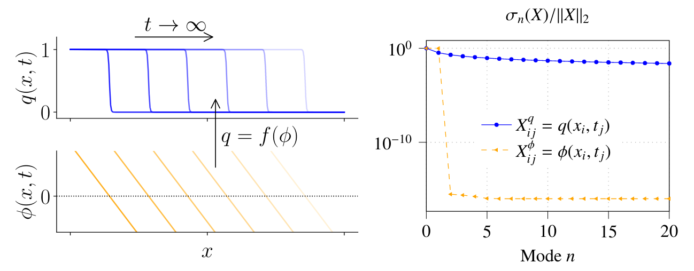

# Front Transport Reduction for Complex Moving Fronts

This is the repository to the publication: 

    @Manual{KrahBuechholzHaeringerReiss2022,
            title = {Front Transport Reduction for Complex Moving Fronts},
            author = {Krah, Philipp and Büchholz, Steffen and Häringer, Matthias and Reiss, Julius},
            organization = {Preprint on arxiv:},
            year = {2022},
            url = {https://arxiv.org/abs/},
    }

Please cite our work if you use the code.
All Matlab and Python sources are contained in the `lib/` folder. 

The `examples/` folder, contains the following examples of the paper:

+ `01_moving_disk.py`: Implements the results of the 2D disk that moves in a circle. It includes:
  + training of autoencoder networks and FTR-thresholding algorithm, POD
  + online predictions using Fourier-Koopman forecasting
+ `02_topo_change.py`: Same as first example but with topology changing fronts
+ `03_bunsen_flame.py`: Imports the multi-slit bunsen flame data and computes a low rank description from it
+ `04_advection_FTR_galerkin.m`: basic FTR example in 1D advection example including:
  + generation of data from a PDE
  + dim. reduction using FTR, POD
  + galerkin projections
+ `05_reaction_diffusion_FTR_galerkin.m`: basic FTR example for 1D reaction-diffusion equation
+ `06_reaction_diffusion_hyper-FTR_galerkin.py`: hyper-FTR example for 1D reaction-diffusion equation
+ `07_ARD_2d_hyper-FTR.py`: hyper-FTR example for advection-reaction-diffusion equation in 2D

